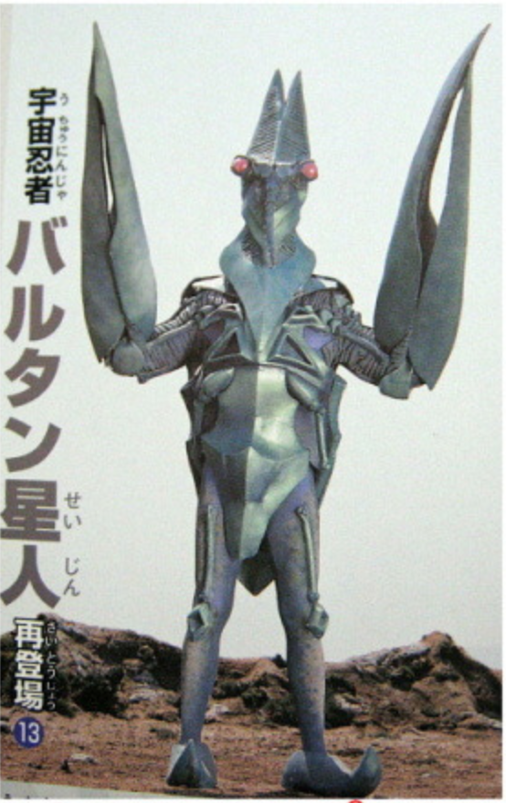

# Psycho Baltan

## Show

Ultraman: the Ultimate Hero

## Place of origin
Planet Baltan

## Height
micro - 65 meters

## Weight

0 - 23,000 tons

## Powers

### Bio Beam (バイオビーム Baio Bīmu)

Alien Baltan can release powerful energy blasts from inside his claws that can destroy entire buildings.

### Flash Physic/Anti-gravity Wave

Alien Baltan can emit shock waves of great push back force from inside his claws.

### Poison Stream

A small stream of blinding poison exhaled from his mouth.

### Molting

Can shed his skin to dodge attacks.

### Illusions

Can create multiple illusions of itself to confuse enemies.

### Fusion Growth

Alien Baltan can increase his size by fusing with other members of his species or his illusions.

### Flight

By sprouting wings from his back, Alien Baltan can fly through the air at speeds that rival those of even Ultraman Powered.
