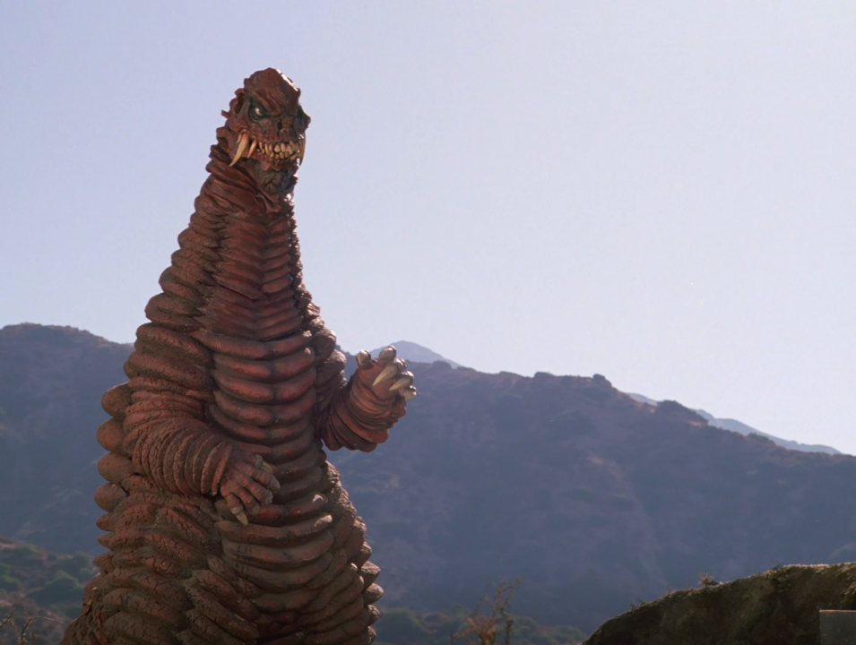
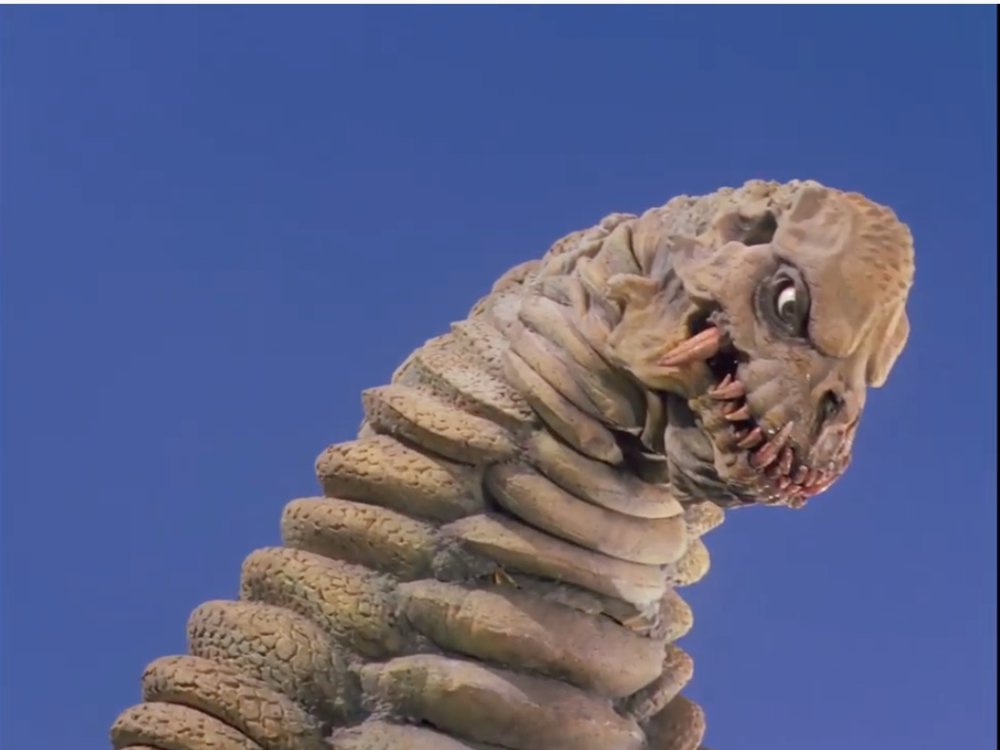

# Powered Red Kings

## Show

Ultraman: the Ultimate Hero

## Place of origin
Planet Earth --- Guiana Highlands

## Height
60 meters (Female), 70 meters (Male)

## Weight

30,000 tons (Female), 42,000 tons (Male)

## Powers

### Physical Strength

While the male Red King is stronger than the female, both are much stronger than
the typical Ultraman monsters. One kick was enough to shatter King Joe Black's
armor.

### Mega-Ton Tail

Powerful enough to knock a monster senseless, whip rocks at enemies, and propel
themselves through the air.

## Weaknesses

### Feet

It's believed that Red King's weak spot are his very tender little piggies. If
one stubs its toe, it's out for the count.
